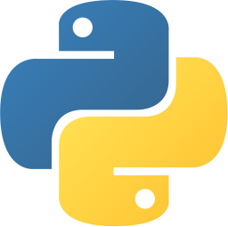

# awesome-mcp

> [!TIP]
> Come and submit your favorite MCP Servers, [click it](https://github.com/aimcp/awesome-mcp/issues/new?template=add-mcp-server.md).

## Mcp Servers

### official

- [AWS KB Retrieval](https://github.com/modelcontextprotocol/servers/tree/main/src/aws-kb-retrieval-server) -  An MCP server implementation for retrieving information from the AWS Knowledge Base using the Bedrock Agent Runtime.
- [Brave Search](https://github.com/modelcontextprotocol/servers/tree/main/src/brave-search) -  An MCP server implementation that integrates the Brave Search API, providing both web and local search capabilities.
- [EverArt](https://github.com/modelcontextprotocol/servers/tree/main/src/everart) -  Image generation server using EverArt's API.
- [Fetch](https://github.com/modelcontextprotocol/servers/tree/main/src/fetch) -  A Model Context Protocol server that provides web content fetching capabilities. This server enables LLMs to retrieve and process content from web pages, converting HTML to markdown for easier consumption.
- [Filesystem](https://github.com/modelcontextprotocol/servers/tree/main/src/filesystem) -  Node.js server implementing Model Context Protocol (MCP) for filesystem operations.
- [Google Drive](https://github.com/modelcontextprotocol/servers/tree/main/src/gdrive) -  This MCP server integrates with Google Drive to allow listing, reading, and searching over files.
- [Git](https://github.com/modelcontextprotocol/servers/tree/main/src/git) -  A Model Context Protocol server for Git repository interaction and automation. This server provides tools to read, search, and manipulate Git repositories via Large Language Models.
- [GitHub](https://github.com/modelcontextprotocol/servers/tree/main/src/github) -  MCP Server for the GitHub API, enabling file operations, repository management, search functionality, and more.
- [GitLab](https://github.com/modelcontextprotocol/servers/tree/main/src/gitlab) -  MCP Server for the GitLab API, enabling project management, file operations, and more.
- [Google Maps](https://github.com/modelcontextprotocol/servers/tree/main/src/google-maps) -  MCP Server for the Google Maps API.
- [Knowledge Graph Memory](https://github.com/modelcontextprotocol/servers/tree/main/src/memory) -  A basic implementation of persistent memory using a local knowledge graph. This lets LLM remember information about the user across chats.
- [PostgreSQL](https://github.com/modelcontextprotocol/servers/tree/main/src/postgres) -  A Model Context Protocol server that provides read-only access to PostgreSQL databases. This server enables LLMs to inspect database schemas and execute read-only queries.
- [Puppeteer](https://github.com/modelcontextprotocol/servers/tree/main/src/puppeteer) -  A Model Context Protocol server that provides browser automation capabilities using Puppeteer. This server enables LLMs to interact with web pages, take screenshots, and execute JavaScript in a real browser environment.
- [Redis](https://github.com/modelcontextprotocol/servers/tree/main/src/redis) -  A Model Context Protocol server that provides access to Redis databases. This server enables LLMs to interact with Redis key-value stores through a set of standardized tools.
- [Sentry](https://github.com/modelcontextprotocol/servers/tree/main/src/sentry) -  A Model Context Protocol server for retrieving and analyzing issues from Sentry.io. This server provides tools to inspect error reports, stacktraces, and other debugging information from your Sentry account.
- [Sequential Thinking](https://github.com/modelcontextprotocol/servers/tree/main/src/sequentialthinking) -  An MCP server implementation that provides a tool for dynamic and reflective problem-solving through a structured thinking process.
- [Slack](https://github.com/modelcontextprotocol/servers/tree/main/src/slack) -  An MCP server for the Slack API and interact with Slack workspaces.
- [SQLite](https://github.com/modelcontextprotocol/servers/tree/main/src/sqlite) -  A Model Context Protocol (MCP) server implementation that provides database interaction and business intelligence capabilities through SQLite. This server enables running SQL queries, analyzing business data, and automatically generating business insight memos.
- [Time](https://github.com/modelcontextprotocol/servers/tree/main/src/time) -  A Model Context Protocol server that provides time and timezone conversion capabilities. This server enables LLMs to get current time information and perform timezone conversions using IANA timezone names, with automatic system timezone detection.

### ai

- [Knowledge Graph Memory](https://github.com/modelcontextprotocol/servers/tree/main/src/memory) -  A basic implementation of persistent memory using a local knowledge graph. This lets LLM remember information about the user across chats.
- [Sequential Thinking](https://github.com/modelcontextprotocol/servers/tree/main/src/sequentialthinking) -  An MCP server implementation that provides a tool for dynamic and reflective problem-solving through a structured thinking process.

### analysis

- [Knowledge Graph Memory](https://github.com/modelcontextprotocol/servers/tree/main/src/memory) -  A basic implementation of persistent memory using a local knowledge graph. This lets LLM remember information about the user across chats.
- [Sequential Thinking](https://github.com/modelcontextprotocol/servers/tree/main/src/sequentialthinking) -  An MCP server implementation that provides a tool for dynamic and reflective problem-solving through a structured thinking process.
- [Spotify](https://github.com/varunneal/spotify-mcp) -  Control Spotify playback and manage playlists

### browser

- [Fetch](https://github.com/modelcontextprotocol/servers/tree/main/src/fetch) -  A Model Context Protocol server that provides web content fetching capabilities. This server enables LLMs to retrieve and process content from web pages, converting HTML to markdown for easier consumption.
- [Puppeteer](https://github.com/modelcontextprotocol/servers/tree/main/src/puppeteer) -  A Model Context Protocol server that provides browser automation capabilities using Puppeteer. This server enables LLMs to interact with web pages, take screenshots, and execute JavaScript in a real browser environment.
- [Search1API](https://github.com/fatwang2/search1api-mcp) -  Unified API for search, crawling, and sitemaps by Search1 API
- [Playwright MCP](https://github.com/microsoft/playwright-mcp) -  A Model Context Protocol (MCP) server that provides browser automation capabilities using Playwright. This server enables LLMs to interact with web pages through structured accessibility snapshots, bypassing the need for screenshots or visually-tuned models.

### code

- [Git](https://github.com/modelcontextprotocol/servers/tree/main/src/git) -  A Model Context Protocol server for Git repository interaction and automation. This server provides tools to read, search, and manipulate Git repositories via Large Language Models.
- [GitHub](https://github.com/modelcontextprotocol/servers/tree/main/src/github) -  MCP Server for the GitHub API, enabling file operations, repository management, search functionality, and more.
- [GitLab](https://github.com/modelcontextprotocol/servers/tree/main/src/gitlab) -  MCP Server for the GitLab API, enabling project management, file operations, and more.
- [E2B (JS)](https://github.com/e2b-dev/mcp-server/tree/main/packages/js) -  Execute code in secure cloud sandboxes by E2B
- [E2B (Python)](https://github.com/e2b-dev/mcp-server/tree/main/packages/python) -  Execute code in secure cloud sandboxes by E2B

### databases

- [PostgreSQL](https://github.com/modelcontextprotocol/servers/tree/main/src/postgres) -  A Model Context Protocol server that provides read-only access to PostgreSQL databases. This server enables LLMs to inspect database schemas and execute read-only queries.
- [Redis](https://github.com/modelcontextprotocol/servers/tree/main/src/redis) -  A Model Context Protocol server that provides access to Redis databases. This server enables LLMs to interact with Redis key-value stores through a set of standardized tools.
- [SQLite](https://github.com/modelcontextprotocol/servers/tree/main/src/sqlite) -  A Model Context Protocol (MCP) server implementation that provides database interaction and business intelligence capabilities through SQLite. This server enables running SQL queries, analyzing business data, and automatically generating business insight memos.

### images

- [EverArt](https://github.com/modelcontextprotocol/servers/tree/main/src/everart) -  Image generation server using EverArt's API.

### integration

- [AWS KB Retrieval](https://github.com/modelcontextprotocol/servers/tree/main/src/aws-kb-retrieval-server) -  An MCP server implementation for retrieving information from the AWS Knowledge Base using the Bedrock Agent Runtime.
- [Google Drive](https://github.com/modelcontextprotocol/servers/tree/main/src/gdrive) -  This MCP server integrates with Google Drive to allow listing, reading, and searching over files.
- [GitHub](https://github.com/modelcontextprotocol/servers/tree/main/src/github) -  MCP Server for the GitHub API, enabling file operations, repository management, search functionality, and more.
- [GitLab](https://github.com/modelcontextprotocol/servers/tree/main/src/gitlab) -  MCP Server for the GitLab API, enabling project management, file operations, and more.
- [Google Maps](https://github.com/modelcontextprotocol/servers/tree/main/src/google-maps) -  MCP Server for the Google Maps API.
- [Sentry](https://github.com/modelcontextprotocol/servers/tree/main/src/sentry) -  A Model Context Protocol server for retrieving and analyzing issues from Sentry.io. This server provides tools to inspect error reports, stacktraces, and other debugging information from your Sentry account.
- [Slack](https://github.com/modelcontextprotocol/servers/tree/main/src/slack) -  An MCP server for the Slack API and interact with Slack workspaces.
- [Axiom](https://github.com/axiomhq/mcp-server-axiom) -  Query and analyze logs, traces, and event data using natural language using Axiom Processing Language (APL).
- [Cloudflare](https://github.com/cloudflare/mcp-server-cloudflare) -  Deploy and manage resources on the Cloudflare developer platform
- [E2B (JS)](https://github.com/e2b-dev/mcp-server/tree/main/packages/js) -  Execute code in secure cloud sandboxes by E2B
- [E2B (Python)](https://github.com/e2b-dev/mcp-server/tree/main/packages/python) -  Execute code in secure cloud sandboxes by E2B
- [Neon](https://github.com/neondatabase/mcp-server-neon) -  Interact with the Neon serverless Postgres platform
- [Qdrant](https://github.com/qdrant/mcp-server-qdrant) -  Implement semantic memory using the Qdrant vector search engine
- [Search1API](https://github.com/fatwang2/search1api-mcp) -  Unified API for search, crawling, and sitemaps by Search1 API
- [Stripe Agent Toolkit (Python)](https://github.com/stripe/agent-toolkit/tree/main/python) -  Interact with the Stripe API
- [Stripe Agent Toolkit (TS)](https://github.com/stripe/agent-toolkit/tree/main/typescript) -  Interact with the Stripe API
- [Docker](https://github.com/ckreiling/mcp-server-docker) -  Manage containers, images, volumes, and networks
- [Kubernetes](https://github.com/Flux159/mcp-server-kubernetes) -  Manage pods, deployments, and services
- [Linear](https://github.com/jerhadf/linear-mcp-server) -  Project management and issue tracking
- [Spotify](https://github.com/varunneal/spotify-mcp) -  Control Spotify playback and manage playlists
- [PBS API](https://github.com/matthewdcage/pbs-mcp-server) -  A standalone Model Context Protocol (MCP) server that allows AI models to access the Australian Pharmaceutical Benefits Scheme (PBS) API, which contains information about medicines, pricing, and availability in Australia.
- [BlenderMCP](https://github.com/ahujasid/blender-mcp) -  BlenderMCP connects Blender to Claude AI through the Model Context Protocol (MCP), allowing Claude to directly interact with and control Blender. This integration enables prompt assisted 3D modeling, scene creation, and manipulation.
- [WhatsApp MCP Server](https://github.com/lharries/whatsapp-mcp) -  This is a Model Context Protocol (MCP) server for WhatsApp.With this you can search you personal Whatsapp messages, search your contacts and send messages to either individuals or groups.
- [ghidraMCP](https://github.com/LaurieWired/GhidraMCP) -  ghidraMCP is an Model Context Protocol server for allowing LLMs to autonomously reverse engineer applications. It exposes numerous tools from core Ghidra functionality to MCP clients.
- [Framelink Figma MCP Server](https://github.com/GLips/Figma-Context-MCP) -  Give your coding agent access to your Figma data. Implement designs in any framework in one-shot.
- [Firecrawl MCP Server](https://github.com/mendableai/firecrawl-mcp-server) -  A Model Context Protocol (MCP) server implementation that integrates with Firecrawl for web scraping capabilities.
- [Unity MCP](https://github.com/justinpbarnett/unity-mcp) -  A Unity package that enables seamless communication between Unity and Large Language Models (LLMs) like Claude Desktop via the Model Context Protocol (MCP). This server acts as a bridge, allowing Unity to send commands to and receive responses from MCP-compliant tools, empowering developers to automate workflows, manipulate assets, and control the Unity Editor programmatically.
- [QA Sphere MCP Server](https://github.com/Hypersequent/qasphere-mcp) -  his integration enables Large Language Models (LLMs) to interact directly with QA Sphere test cases, allowing you to discover, summarize, and chat about test cases. In AI-powered IDEs that support MCP, you can reference specific QA Sphere test cases within your development workflow.

### location & time

- [Google Maps](https://github.com/modelcontextprotocol/servers/tree/main/src/google-maps) -  MCP Server for the Google Maps API.
- [Time](https://github.com/modelcontextprotocol/servers/tree/main/src/time) -  A Model Context Protocol server that provides time and timezone conversion capabilities. This server enables LLMs to get current time information and perform timezone conversions using IANA timezone names, with automatic system timezone detection.

### monitor

- [Sentry](https://github.com/modelcontextprotocol/servers/tree/main/src/sentry) -  A Model Context Protocol server for retrieving and analyzing issues from Sentry.io. This server provides tools to inspect error reports, stacktraces, and other debugging information from your Sentry account.
- [Axiom](https://github.com/axiomhq/mcp-server-axiom) -  Query and analyze logs, traces, and event data using natural language using Axiom Processing Language (APL).
- [Kubernetes](https://github.com/Flux159/mcp-server-kubernetes) -  Manage pods, deployments, and services
- [Spotify](https://github.com/varunneal/spotify-mcp) -  Control Spotify playback and manage playlists

### notification

- [Slack](https://github.com/modelcontextprotocol/servers/tree/main/src/slack) -  An MCP server for the Slack API and interact with Slack workspaces.

### search

- [AWS KB Retrieval](https://github.com/modelcontextprotocol/servers/tree/main/src/aws-kb-retrieval-server) -  An MCP server implementation for retrieving information from the AWS Knowledge Base using the Bedrock Agent Runtime.
- [Brave Search](https://github.com/modelcontextprotocol/servers/tree/main/src/brave-search) -  An MCP server implementation that integrates the Brave Search API, providing both web and local search capabilities.
- [Google Drive](https://github.com/modelcontextprotocol/servers/tree/main/src/gdrive) -  This MCP server integrates with Google Drive to allow listing, reading, and searching over files.
- [Obsidian](https://github.com/smithery-ai/mcp-obsidian) -  Read and search through Markdown notes in Obsidian vaults
- [Qdrant](https://github.com/qdrant/mcp-server-qdrant) -  Implement semantic memory using the Qdrant vector search engine
- [Search1API](https://github.com/fatwang2/search1api-mcp) -  Unified API for search, crawling, and sitemaps by Search1 API

### storage

- [Filesystem](https://github.com/modelcontextprotocol/servers/tree/main/src/filesystem) -  Node.js server implementing Model Context Protocol (MCP) for filesystem operations.
- [Google Drive](https://github.com/modelcontextprotocol/servers/tree/main/src/gdrive) -  This MCP server integrates with Google Drive to allow listing, reading, and searching over files.
- [PostgreSQL](https://github.com/modelcontextprotocol/servers/tree/main/src/postgres) -  A Model Context Protocol server that provides read-only access to PostgreSQL databases. This server enables LLMs to inspect database schemas and execute read-only queries.
- [Redis](https://github.com/modelcontextprotocol/servers/tree/main/src/redis) -  A Model Context Protocol server that provides access to Redis databases. This server enables LLMs to interact with Redis key-value stores through a set of standardized tools.
- [SQLite](https://github.com/modelcontextprotocol/servers/tree/main/src/sqlite) -  A Model Context Protocol (MCP) server implementation that provides database interaction and business intelligence capabilities through SQLite. This server enables running SQL queries, analyzing business data, and automatically generating business insight memos.
- [Neon](https://github.com/neondatabase/mcp-server-neon) -  Interact with the Neon serverless Postgres platform
- [Obsidian](https://github.com/smithery-ai/mcp-obsidian) -  Read and search through Markdown notes in Obsidian vaults
- [Qdrant](https://github.com/qdrant/mcp-server-qdrant) -  Implement semantic memory using the Qdrant vector search engine
- [PBS API](https://github.com/matthewdcage/pbs-mcp-server) -  A standalone Model Context Protocol (MCP) server that allows AI models to access the Australian Pharmaceutical Benefits Scheme (PBS) API, which contains information about medicines, pricing, and availability in Australia.
